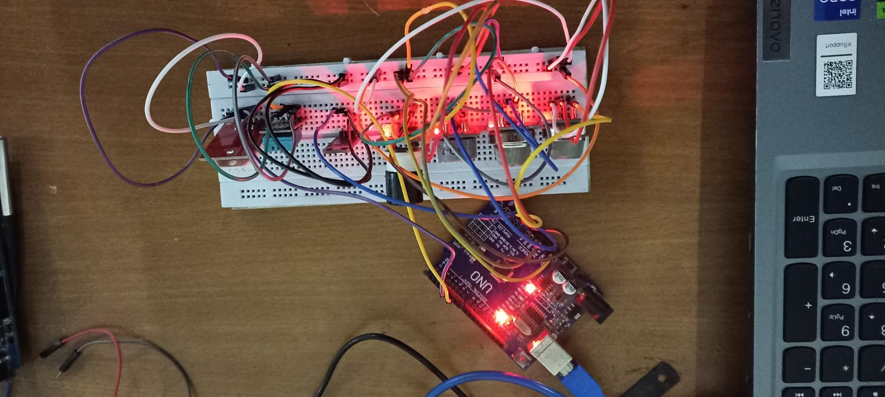
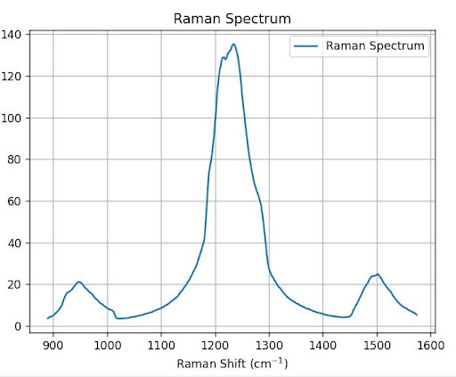
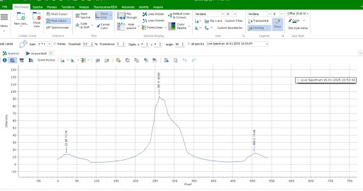
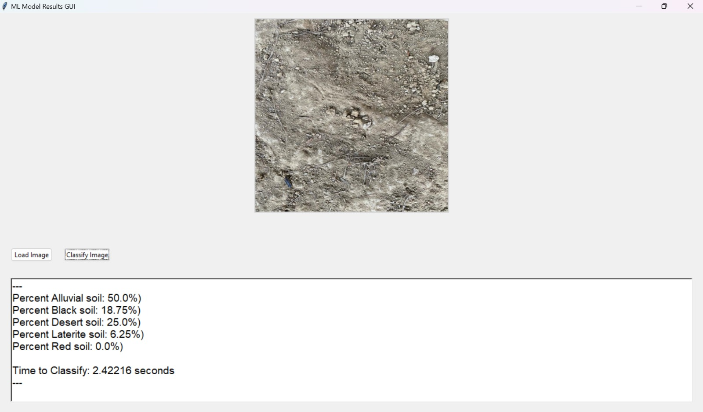

# Team INFERNO DTU — Science & Research Work

## Overview  
Team INFERNO DTU is a diverse group of students dedicated to designing and building **Mars rover prototypes** for international competitions. The team includes members from science, mechanical, electrical, and software backgrounds, who work together closely.  

I was part of the **Science and Research Department**, where I focused on creating scientific instruments and data-driven systems for **planetary surface analysis and exploration tasks**. All projects were developed with strict limits on power, size, budget, durability, and competition deadlines closely resembling real-world space-mission engineering challenges.

---
## Projects

### 1) In-situ Terrain Chemistry & Atmosphere Sensing Module  

Designed and developed an **in-situ chemical and atmospheric sensing module** for planetary surface exploration. The system integrated **eight metal-oxide semiconductor (MOS) gas sensors** to detect gases such as carbon monoxide (CO), carbon dioxide (CO₂), methane (CH₄), and ammonia (NH₃). A **UV radiation sensor** was interfaced using an Arduino Mega to monitor environmental radiation levels.

In addition to atmospheric sensing, **reagent-based soil testing** was implemented using three chemical reagents to probe potential **biomarkers relevant to life detection**. The module was optimized for rover deployment, emphasizing reliability, low power consumption, and compact design.

**Figure:** In-situ terrain chemistry and atmosphere sensing module developed for rover deployment. The images collectively show the integrated hardware architecture, including the multi-sensor MOS gas array for atmospheric analysis, UV radiation sensing, and reagent-based soil testing components designed to probe potential biomarkers under realistic planetary exploration constraints.

---
### 2️) Raman Spectrometer for Soil Sample Analysis  

Designed and assembled a **compact, low-cost Raman spectrometer** for chemical and mineral identification in soil samples. The instrument employed a webcam-based optical setup housed in a **custom 3D-printed enclosure**, making it suitable for integration into a rover platform.

Spectral analysis was performed using **Spectragryph**, where intensity–pixel plots were calibrated using known reference samples. Polynomial fitting was applied to convert pixel positions into Raman shifts, enabling the identification of unknown compounds through characteristic spectral peaks. This project demonstrated the feasibility of portable spectroscopic analysis for planetary exploration.

**Figure 1:** Calibrated Raman spectrum showing intensity as a function of Raman shift (cm⁻¹). The spectrum is obtained after wavelength calibration using reference samples and polynomial fitting, enabling identification of characteristic Raman peaks for compound analysis.

**Figure 2:** Raw spectroscopic data analyzed using Spectragryph, illustrating peak detection and labeling prior to calibration. These identified peaks are used to map pixel positions to Raman shifts and validate compound signatures.

---
### 3️) Soil Classification via Machine Learning  
Developed a **machine-learning-based soil classification system** to support autonomous terrain analysis. A dataset of over **10,000 soil images** was curated and preprocessed using resizing, normalization, and data augmentation techniques. A **convolutional neural network (CNN)** was trained using TensorFlow, achieving a classification accuracy of approximately **76%**.

The trained model was integrated into rover testing environments, demonstrating the potential of onboard, data-driven soil characterization to assist scientific decision-making during exploration tasks.

**Figure:** Results of the machine-learning–based soil classification model trained on over 10,000 soil images. The figure illustrates the model’s performance in distinguishing different soil types, demonstrating the feasibility of data-driven terrain analysis for autonomous rover operations.

---
